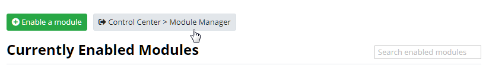
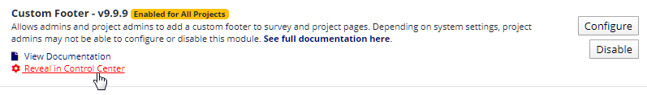
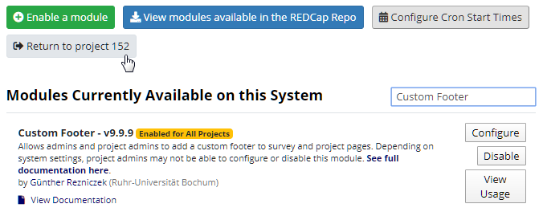
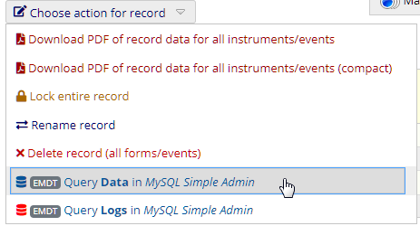
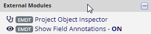
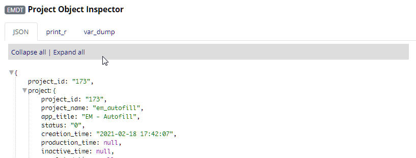
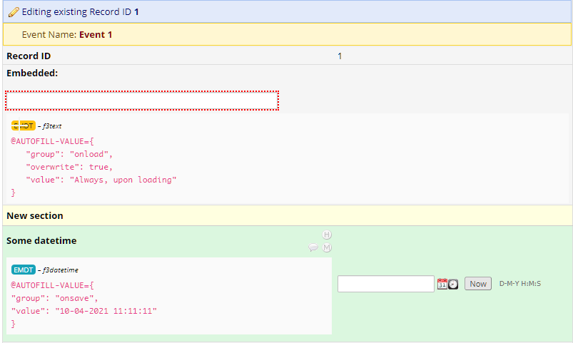
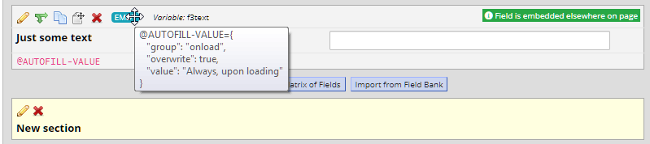

# External Module Developer Tools

A REDCap external module providing tools and enhancements with regard for EM development.

**Feature and pull requests** (against _master_) are welcome!

## Requirements

- REDCAP 11.1.1 or newer.
- MySQL Simple Admin external module (for certain features).

## Installation

Automatic installation:

- Install this module from the REDCap External Module Repository and enable it.

Manual installation:

- Clone this repo into `<redcap-root>/modules/emm_tools_v<version-number>`.
- Go to _Control Center > Technical / Developer Tools > External Modules_ and enable 'External Module Developer Tools'.

## Configuration and Effects

Enable the features you want in this module's **system configuration**. Make sure to **enable the module for all projects** (or for specific projects, e.g. during development). In any case, this module will be invisible to non-admin users. To use all features, at least _Access to all projects and data with maximum user privileges_ and _Access to Control Center dashboards_ are required.

Features provided are:

- **Module Manager Shortcut** - Adds a shortcut link to 'Control Center > External Modules' on the _Project Module Manager_ page.
  
- **Module System Configuration Shortcut** - Adds shortcut links for individual modules on the _Project Module Manager_ page, linking to the _Module Manager_ with search set to the respective module's name.
  
- Both provide a 'Return to project' link is displayed on the _Module Manager_ page.
  
- **Module config query in MySQL Simple Admin** - Adds shortcut links for individual modules on the _Module Manager_ pages, which open the _MySQL Simple Admin_ external module in a new browser tab (automatically performing a query for the module's settings in the current context).
- **Record data query link** - Adds a shortcut link for to the _Record Actions_ menu on the _Record Home Page_ that opens the _MySQL Simple Admin_ external module in a new browser tab, automatically performing a query for the record in the _redcap_data_ table.
  
- **Record log query link** - Adds a shortcut link for to the _Record Actions_ menu on the _Record Home Page_ that opens the _MySQL Simple Admin_ external module in a new browser tab, automatically performing a query for the record in the appropriate _redcap_log_event_ table.
- **Project Links**  
  
  - **Project Object Inspector** - A plugin page that prints the Project object.
  
  - **Show Field Annotations** - When turned on (via a link in the External Modules section of REDCap's main project-context menu), field annotations will be displayed on data entry forms and survey pages in the respective field's label. In case the field is embedded, the annotations will be appended to the embedding container.  
  Additionally, the Online Designer overview will have EMDT badges that show the field annotations when hovered over. Note that certain operations will remove the badges until the page is reloaded.  
  **Note**: Pages have to be reloaded after switching on/off field annotations.
  
  

## Testing

Instructions for testing the module can be found [here](?prefix=emm_tools&page=tests/EMDToolsManualTest.md).

## Changelog

Version | Description
------- | --------------------
v1.5.0  | Supports CSRF tokens in AJAX requests (Framework v8). Prevents some false positives in PSALM testing.
v1.4.0  | Module renamed to _External Module **Developer** Tools_. New feature: Show Field Annotations. New feature: Project Object as JSON.
v1.3.3  | Bug fix: USERID check done right (avoids exceptions in some cases).
v1.3.2  | Bug fix: SUPER_USER check done right (avoids exceptions in some cases).
v1.3.1  | Bug fix: Project was not fully loaded before display.
v1.3.0  | New feature: Project Object Inspector
v1.2.1  | Bug fix: Record log querying could not be turned on/off separately; requires REDCap 10.1.0 (new granular admin privileges).
v1.2.0  | Adds a link to the record actions that queries the record's log with MySQL Simple Admin.
v1.1.6  | Finetuning of SQL sent to MySQL Simple Admin.
v1.1.5  | Adds a link to the record actions that queries the record with MySQL Simple Admin.
v1.1.4  | Module config query now supports system context.
v1.1.3  | Fix a bug that would emerge with the release of EM framework v5.
v1.1.2  | Minor bug fix.
v1.1.1  | Minor enhancements. Add instructions for testing the module.
v1.1.0  | New feature: Query module config in MySQL Simple Admin.
v1.0.1  | Bug fixes.
v1.0.0  | Initial release.
